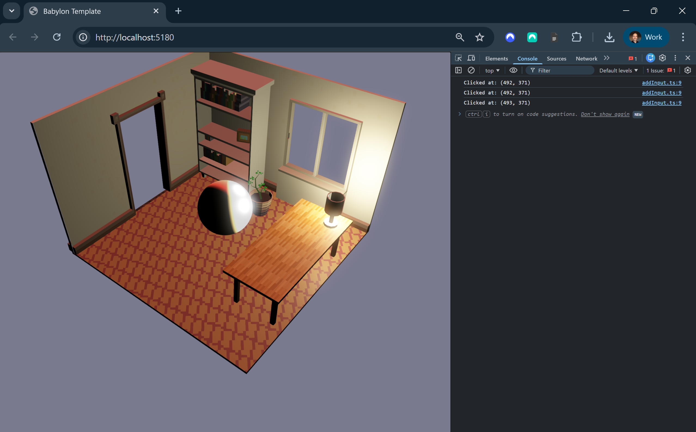

# Babylon Space Harrier

This repo is a starting point for Babylon.js projects using TypeScript.
It includes physics, post-processing, tests, and a modular structure.

<figure>
  
  <figcaption>
    Image 1 - Babylon.js Game Engine - HTML5 + WebGPU
  </figcaption>
</figure>

## Table of Contents

1. [Getting Started](#getting-started)
2. [Project Overview](#project-overview)
3. [Project Details](#project-details)
4. [Resources](#resources)
5. [Credits](#credits)

## Getting Started

### Play Project

1. Clone or download this repo.
2. Open the `Babylon` folder in a command line.
3. Run `npm install` to download and install dependencies.
4. Run `npm run build` to build the project.
5. Run `npm run dev` to launch a local development server.

### More Commands

- `npm install`: Download and install dependencies.
- `npm run build`: Build the app.
- `npm run dev`: Run the app locally with hot reload.
- `npm run test`: Run unit tests.

## Project Overview

This repo demonstrates browser-based game development with Babylon.js,
TypeScript, and modular architecture. It includes physics integration,
post-processing, and input handling.

Use cases include prototypes, educational projects, and browser games.

### Documentation

- `README.md`: Primary documentation for this repo.

### Configuration

- `Game Engine`: Babylon.js powers the 3D graphics and gameplay systems.

### Structure

- `Babylon`: Main project folder.
- `Babylon/public/assets/glb/`: GLB assets.
- `Babylon/public/index.html`: Entry HTML page.
- `Babylon/src/client/styles/`: CSS styling.
- `Babylon/src/client/scripts/`: Client TypeScript logic.
- `Babylon/src/client/scripts/index.ts`: Main game setup.
- `Babylon/src/tests/client/`: Unit tests.

### Dependencies

- `Babylon/package.json`: Lists dependencies and scripts.

## Project Details

### Editor Tooling

- Visual Studio Code: Source code editor.
- ESLint extension: Linting support for JavaScript and TypeScript.
- Error Lens extension: In-editor error and warning highlights.
- Babylon.js Inspector: Runtime scene inspection.

### Code Packages

- `@babylonjs/core`: Babylon.js core 3D engine.
- `@babylonjs/loaders`: Babylon.js asset loaders.
- `vite`: JavaScript bundling and local dev server.
- `typescript`: TypeScript compiler.
- `eslint`: Linting for TypeScript.
- `vitest`: Unit testing for TypeScript.

## Resources

- [Babylon.js Documentation](https://doc.babylonjs.com/)
- [Babylon.js Playground](https://playground.babylonjs.com/)
- [Babylon.js Inspector](
  https://doc.babylonjs.com/toolsAndResources/inspector
  )
- [TypeScript Documentation](https://www.typescriptlang.org/docs/)

## Credits

### Created By

- Samuel Asher Rivello
- Over 25 years of game development experience as of 2026

### Contact

- Twitter: <https://twitter.com/srivello/>
- Git: <https://github.com/SamuelAsherRivello/>
- Resume and portfolio: <http://www.SamuelAsherRivello.com>
- LinkedIn: <https://Linkedin.com/in/SamuelAsherRivello>

### License

Provided as-is under the MIT License.
Copyright © 2026 Rivello Multimedia Consulting, LLC.
